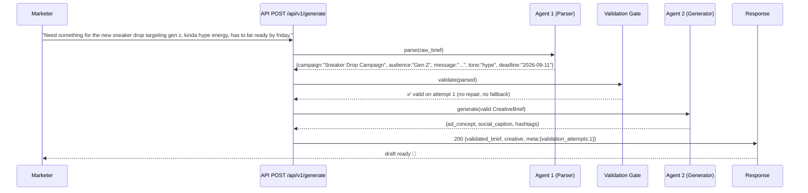
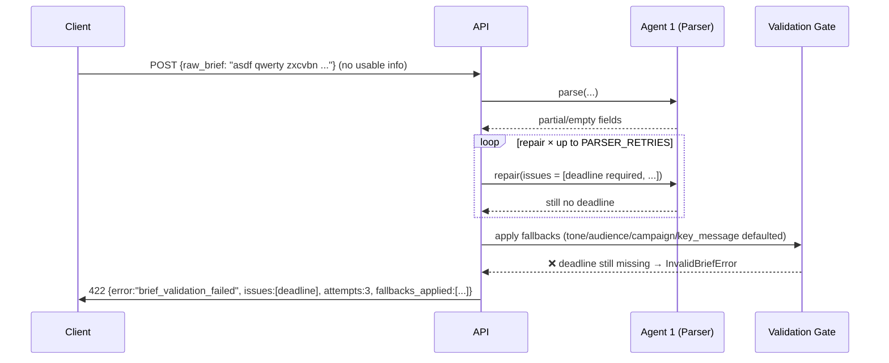
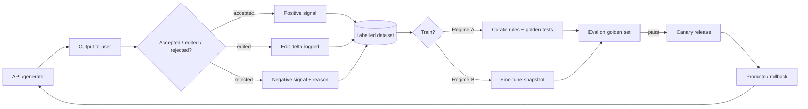

# Product Requirements Document (PRD)

## Creative Brief Agent Pipeline

| | |
|---|---|
| **Product** | Creative Brief Agent Pipeline (2-agent workflow) |
| **Status** | v1.0 implemented & validated — v1.1 design annexed here (§16 Brand Guidelines, §17 Retraining) |
| **This revision** | 2026-09-07 · adds brand-guideline enforcement & retraining/learning design (§16–§17) |
| **Type** | Internal service / API (PoC → production candidate) |
| **Stack** | Python 3.13 · FastAPI · Pydantic v2 · Uvicorn |
| **Last updated** | 2026-09-07 |

---

## 1. Executive Summary

We want to turn a **messy, one-paragraph creative brief** written by a busy
marketer into a **structured, validated, ready-to-use creative asset** — with
zero manual data cleaning and with a hard guarantee that **bad data never flows
silently downstream**.

The product is a small **two-agent AI workflow** wrapped behind one HTTP
endpoint:

- **Agent 1 (Parser)** extracts structured fields (campaign name, audience,
  key message, tone, deadline) from free-form text.
- **A validation gate** checks Agent 1's output against a schema, escalating
  through **retry → fallback → explicit error** so nothing invalid passes.
- **Agent 2 (Generator)** produces creative output (ad concept, social
  caption, hashtags) — and only ever sees schema-valid data.

The service is **provider-agnostic**: it runs out-of-the-box with a
deterministic offline "brain" (no API keys, ideal for demos/tests/CI) and can be
switched to a hosted LLM via configuration.

---

## 2. Problem Statement

### The business problem
Creative briefs arrive as free-form chat, emails, and sticky notes. They are:
- **Inconsistent** — no shared template or field names.
- **Vague** — "gen z", "kinda hype energy", "by friday" carry implicit meaning.
- **Incomplete** — deadlines, campaign names, and audiences are frequently missing.
- **Error-prone to hand off** — humans re-key fields into forms and downstream
  tools silently receive bad or missing data.

Today the cost is manual cleanup, missed deadlines, off-brand tone, and rework.

### The product problem
An AI that reads a brief and *directly* writes an ad will happily
**hallucinate** on missing input (inventing a fake deadline, guessing the wrong
audience) with **no audit trail** of what it did or why. That is unacceptable
for brand work.

### How we solve it
**Separate "reading" from "writing", and put a quality gate between them.**
The pipeline never guesses business-critical facts (like a deadline) — it
retries, then fills only *safe* gaps with *recorded* defaults, and otherwise
**fails loudly** with a structured, explainable error.

---

## 3. Goals & Non-Goals

### 3.1 Goals (v1.0)
| # | Goal | Why it matters |
|---|---|---|
| G1 | Parse a free-form brief into a fixed schema | Downstream systems get consistent data |
| G2 | Never let invalid data reach the generator | Protects brand/creative quality |
| G3 | Explicit, explainable failure | Users understand *why* it failed |
| G4 | Deterministic default behavior (offline) | Zero-friction demo + testable CI |
| G5 | Simple HTTP surface (`POST /generate`) | Easy integration for any client |
| G6 | **Follow brand guidelines** on every output *(v1.1+)* | On-brand, on-message creative, every time |
| G7 | **Learn & retrain** from real usage *(v1.1+)* | Quality improves over time without ad-hoc rewrites |

### 3.2 Non-Goals (v1.0)
- ❌ No multi-campaign / bulk batch processing.
- ❌ No image/video asset generation (text creative only).
- ❌ No human-in-the-loop approval UI (output returned directly).
- ❌ No auth / multi-tenancy / rate limiting (added in a later phase).
- ❌ No long-term persistence of briefs or outputs (stateless calls).
- ❌ No prompt-tuning UI (logic lives in the provider layer).

---

## 4. Target Users & Personas

| Persona | Description | Primary need |
|---|---|---|
| **Creative Marketer** (e.g. "Sam") | Writes briefs quickly, wants an on-brand draft fast. | Paste a brief → get a usable, correctly-toned draft in seconds. |
| **Creative Ops / Program Manager** | Owns quality & deadlines across campaigns. | Guaranteed validation; clear errors; audit trail of what was defaulted. |
| **Engineering / API Consumer** | Integrates the endpoint into tools (CMS, ad platforms). | Stable JSON contract, documented errors, easy to call. |
| **Developer (this repo)** | Extends the agents or swaps the model. | Clean provider abstraction; deterministic tests without an LLM key. |

---

## 5. Product Definition

### 5.1 The 5 structured fields (`CreativeBrief`)

| Field | Type | Example | Notes / business rule |
|---|---|---|---|
| `campaign_name` | `str` (2–120) | `"Sneaker Drop Campaign"` | Human-friendly title; whitespace normalised. |
| `target_audience` | `str` (2–120) | `"Gen Z"` | Who the creative is for. |
| `key_message` | `str` (5–600) | `"Limited pairs, no restocks."` | Core thing to communicate. |
| `tone` | `enum` (9 tones) | `"hype"` | Synonyms auto-normalised (`"hype energy"` → `hype`). |
| `deadline` | `date` (≥ today) | `2026-09-11` | Resolves relative dates (`"friday"` → next Friday). **Never fabricated.** |

**Canonical tones:** `hype · luxury · playful · professional · emotional ·
sustainable · retro · minimal · edgy`.

**Key business rule:** a deadline in the **past** is rejected; a **missing**
deadline is *not* defaulted — it fails the gate (see §7).

### 5.2 The creative output (`CreativeOutput`)
| Field | Description |
|---|---|
| `ad_concept` | One-line ad concept, tone-aware. |
| `social_caption` | Ready-to-post caption (body + CTA + footer). |
| `hashtags` | Suggested hashtags derived from the validated brief. |

### 5.3 The audit trail (`RunMeta`)
Returned on every successful call so consumers can see **what the pipeline did**:
`provider`, `validation_attempts`, `repair_passes`, `fallbacks_applied[]`.

---

## 6. System Architecture

**Style:** Monolithic deployment with **modular boundaries** — one FastAPI
process; responsibilities cleanly separated so each piece is testable and
swappable.

```
┌─────────────────────────────────────────────────────────────────────┐
│                        FastAPI app (one process)                     │
│                                                                      │
│  HTTP  ──►  api/routes.py        (POST /api/v1/generate)             │
│                   │                                                  │
│                   ▼                                                  │
│            services/pipeline.py  (orchestration only, no logic)      │
│                   │                                                  │
│        ┌──────────┼──────────────┐                                   │
│        ▼          ▼              ▼                                   │
│  agents/parser  services/   agents/generator                         │
│   (Agent 1)   validation     (Agent 2)                               │
│        │      (THE GATE)         ▲                                   │
│        └──────────┼──────────────┘                                   │
│                   ▼                                                  │
│            schemas/brief.py                                          │
│          CreativeBrief (Pydantic)                                    │
│                   │                                                  │
│                   ▼                                                  │
│            llm/ (provider abstraction)                               │
│        LocalHeuristic  |  OpenAIProvider                             │
└─────────────────────────────────────────────────────────────────────┘
```

### Layer responsibilities
| Layer | Responsibility | Contains no |
|---|---|---|
| `api/` | HTTP contract, status codes, error mapping | business logic |
| `services/pipeline.py` | Order of operations, wiring | parsing/creative logic |
| `services/validation.py` | The escalation ladder (§7) | provider-specific code |
| `agents/parser.py` | Extraction + targeted repair passes | orchestration |
| `agents/generator.py` | Creative templating from a *valid* brief | validation logic |
| `schemas/brief.py` | The schema that *is* the gate | side effects |
| `llm/` | Swappable "brain" behind one interface | FastAPI concerns |
| `core/` | Config, logging, exceptions | feature logic |

---

## 7. The Validation Gate (the heart of the product)

**Requirement it enforces:** *"Don't let bad data silently flow through."*

### 7.1 Escalation ladder

```
  Agent 1 output
        │
        ▼
  ┌─ VALIDATE ──────────────────────────────────────────────┐
  │  Coerce Parser dict → CreativeBrief (Pydantic)           │
  │  Collect field-level ValidationIssues                    │
  └───────────────┬──────────────────────────────────────────┘
                  │ invalid?
        ┌─────────┴─────────┐
        ▼                   ▼
     valid            ┌─ RETRY ──────────────────────────────┐
        │             │  ≤ max_attempts?                     │
        │             │  Parser.repair(issues) — targeted     │
        │             │  re-extraction MERGED over previous   │
        │             │  (good fields preserved)              │
        │             └───────────────┬──────────────────────┘
        │                             ▼ exhausted
        │                    ┌─ FALLBACK ────────────────────┐
        │                    │  Fill SAFE gaps only, with     │
        │                    │  recorded defaults:            │
        │                    │   • tone → "professional"      │
        │                    │   • audience → "General..."    │
        │                    │   • campaign_name → "Untitled" │
        │                    │   • key_message → generic      │
        │                    │  (deadline is NEVER defaulted) │
        │                    └───────────────┬───────────────┘
        │                                    ▼ still broken?
        │                         ┌─ SURFACE ────────────────┐
        │                         │  Return explicit 422 with │
        │                         │  issues, attempts,        │
        │                         │  fallbacks_applied        │
        │                         └──────────────────────────┘
        ▼
  Generator (valid brief only)  ──►  200 OK + RunMeta
```

### 7.2 Decision table
| Situation | Behaviour |
|---|---|
| All fields valid on first pass | ✅ `200`, `validation_attempts: 1` |
| Field(s) broken | 🔁 Parser does targeted **repair pass(es)** (max `PARSER_RETRIES`) |
| Repair fixes everything | ✅ `200`, `repair_passes ≥ 1` |
| Non-critical gap remains | 🛟 Apply **recorded default**; `fallbacks_applied[]` populated |
| **Deadline** missing/illegible | ❌ **Never defaulted** → **422** with the concrete issue |
| Deadline in the past | ❌ Rejected → **422** |
| Parser returns nothing | ❌ **422** `"Parser returned no structured data at all."` |
| LLM provider down (if configured) | ❌ **503** `provider_unavailable` |

---

## 8. API Specification

### 8.1 Endpoints
| Method | Path | Purpose |
|---|---|---|
| `POST` | `/api/v1/generate` | Main flow: brief → creative |
| `GET` | `/api/v1/health` | Liveness + active provider |
| `GET` | `/api/v1/provider` | Which brain is powering the agents |
| `GET` | `/` | Service info + link to `/docs` |
| `GET` | `/docs` | Interactive Swagger UI (OpenAPI) |

### 8.2 Request — `POST /api/v1/generate`
```jsonc
// Content-Type: application/json
{
  "raw_brief": "Need something for the new sneaker drop targeting gen z,
                kinda hype energy, has to be ready by friday.",
  "context": {}            // optional, reserved for future use
}
```

### 8.3 Responses
**`200 OK`** — success with full audit trail:
```jsonc
{
  "validated_brief": {
    "campaign_name": "Sneaker Drop Campaign",
    "target_audience": "Gen Z",
    "key_message": "The sneaker drop is live — limited pairs, no restocks...",
    "tone": "hype",
    "deadline": "2026-09-11"        // "friday" resolved to next Friday
  },
  "creative": {
    "ad_concept": "...",
    "social_caption": "...",
    "hashtags": ["#SneakerDropCampaign", "#GenZ", "#Hype", "..."]
  },
  "meta": {
    "provider": "local",
    "validation_attempts": 1,
    "repair_passes": 0,
    "fallbacks_applied": []
  }
}
```

**`422 Unprocessable Entity`** — two distinct cases:
1. Request-shape error (e.g. `raw_brief` too short / missing) → standard FastAPI
   validation detail array.
2. **Business validation failure** → structured, explainable error:
```jsonc
{
  "detail": {
    "error": "brief_validation_failed",
    "message": "Brief could not be validated after 3 attempt(s). Refusing to pass bad data...",
    "issues": [ { "field": "deadline", "message": "Field required", "value": null } ],
    "attempts": 3,
    "fallbacks_applied": ["tone defaulted to 'professional'", "..."]
  }
}
```

**`503 Service Unavailable`** — configured LLM provider unreachable.

---

## 9. Configuration & the Swappable "Brain"

| Env var | Default | Purpose |
|---|---|---|
| `LLM_PROVIDER` | `local` | `local` (deterministic, offline) or `openai` |
| `OPENAI_API_KEY` | — | Required only for `openai` |
| `OPENAI_MODEL` | `gpt-4o-mini` | Model when provider is `openai` |
| `PARSER_RETRIES` | `2` | Repair passes the gate may request |
| `LOG_LEVEL` | `INFO` | Logging verbosity |
| `PORT` | `8000` | Server port (`run.py`) |

**Why two providers matters to the product:** the `local` provider is
**deterministic** — identical input always yields identical output with zero
cost/network, which makes demos, CI, and unit tests reliable. The `openai`
provider exercises the *same* code path (retry genuinely re-prompts the model
with its prior errors) so switching brains changes capability, not guarantees.

---

## 10. Functional Requirements (traceable)

| ID | Requirement | Verified by |
|---|---|---|
| FR-1 | System accepts a raw brief ≥5 chars and ≤5000 chars. | API tests |
| FR-2 | Agent 1 extracts the 5 `CreativeBrief` fields from free text. | unit tests |
| FR-3 | Relative deadlines resolve ("friday" → next Friday ≥ today). | unit tests |
| FR-4 | Tone synonyms normalise to canonical values. | unit tests |
| FR-5 | Past deadlines are rejected by the schema. | unit tests |
| FR-6 | Invalid parser output triggers targeted repair pass(es), merging over prior good fields. | unit tests |
| FR-7 | Remaining safe gaps receive *recorded* defaults (never silent). | unit tests |
| FR-8 | Missing/illegible `deadline` → explicit structured failure (never fabricated). | unit tests + live |
| FR-9 | Agent 2 receives **only** a schema-valid brief. | architecture (pipeline) |
| FR-10 | `POST /generate` returns `validated_brief`, `creative`, `meta`. | API tests + live |
| FR-11 | Error responses carry concrete `issues`, `attempts`, `fallbacks_applied`. | API tests + live |
| FR-12 | Runs offline/deterministically with no API key by default. | config + live |
| FR-13 | Output text is valid UTF-8 (em dashes, accents preserved). | live check |

---

## 11. Non-Functional Requirements

| Category | Requirement |
|---|---|
| **Reliability** | Business-critical fields never auto-invented; failures are explicit & structured. |
| **Determinism** | Default provider returns identical output for identical input (testable). |
| **Performance** | Local provider: sub-second response (no network). P99 target < 2s with LLM. |
| **Operability** | Structured JSON logs; health endpoint; env-driven config; 12-factor style. |
| **Testability** | Provider-agnostic core → full suite runs without external services (17 tests). |
| **Security** | No secrets in code; key via env; input length-capped (5k) to bound abuse. |
| **Extensibility** | New tones / providers / creative formats added via config or small modules. |

---

## 12. Success Metrics (KPIs)

| Metric | Target (v1) | How measured |
|---|---|---|
| **% of briefs auto-validated** (no manual fix) | ≥ 90% on realistic briefs | API `meta.validation_attempts` / `fallbacks_applied` |
| **Zero silent failures** | 100% of invalid runs return an explicit error | log + 422 audit |
| **Deadline never fabricated** | 0 incidents | schema rule + tests |
| **Deterministic correctness** | 17/17 tests green offline | `pytest` in CI |
| **API success rate** | ≥ 99.5% (`200` + expected `4xx`) | server logs |
| **Brand compliance** *(v1.1+)* | ≥ 98% of outputs pass the brand gate | brand-gate audit log |
| **Accepted-draft rate** *(v1.1+)* | ≥ 70% used without human edits | feedback signals (§17) |
| **Retrain safety** *(v1.1+)* | 0 regressions on the golden set when a rule/model is promoted | eval harness in CI |

---

## 13. Edge Cases & Decisions Log

| # | Edge case | Decision |
|---|---|---|
| EC-1 | "friday" with no date | Resolve to the **next** Friday ≥ today (`2026-09-11`). |
| EC-2 | Brief mentions past date | Reject as past deadline (business rule). |
| EC-3 | No campaign name anywhere | Fallback `"Untitled Campaign"` (safe, recorded). |
| EC-4 | No tone given | Fallback `"professional"` (safe, recorded). |
| EC-5 | Repair pass makes no progress | Stop retrying immediately (no infinite loop). |
| EC-6 | Parser returns `{}` | Surface `"no structured data at all"` → 422. |
| EC-7 | Repair wipes previously-good fields | **Merge** semantics: repaired dict merges over prior parse. |
| EC-8 | Unicode in output (em dash, accents) | Responses are UTF-8; verified end-to-end. |
| EC-9 | Port 8000 blocked on a machine | `PORT` env override in `run.py` (Windows bind quirk). |

---

## 14. Sample Flow Walkthrough (acceptance scenario)





---

## 15. Test Strategy

| Level | Covers | Count |
|---|---|---|
| Unit — parser | field extraction, "friday" resolution, tone synonyms | ~17 tests total |
| Unit — validation | retry/repair, fallback recording, past-deadline rejection | ✓ |
| Integration — pipeline | Agent1 → gate → Agent2 happy path | ✓ |
| API — HTTP | `POST /generate` 200/422, health, UTF-8 | ✓ |
| Live smoke | Real server + real sample brief (verified) | ✓ |

Run: `python -m pytest`  →  **17 passed** (verified 2026-09-07).

---

## 16. Brand-Guideline Enforcement (how the system follows brand rules)

> Status: **v1.0 enforces a built-in default brand voice**. v1.1 proposes
> **per-brand profiles** wired through the same "no silent bad data" ladder.

### 16.1 What "brand guidelines" means here

Following brand guidelines = every creative output is **on-brand** (approved
voice & tone), **on-message** (no banned/unapproved wording), and **consistent**
(uses the brand's templates & vocabulary). We enforce this the same way we
enforce everything else in this product: **as explicit, checkable rules —
never as a silent hope.**

### 16.2 What is already enforced today (v1.0)

The deterministic "brain" and the schema *are* a small brand rulebook:

| Layer | Brand guardrail it enforces | Location |
|---|---|---|
| Canonical `Tone` enum | Output may only use a **fixed, approved voice set** (9 tones) | `app/schemas/brief.py` |
| `TONE_SYNONYMS` | Brief language is **normalised to the brand vocabulary** ("hype energy" → `hype`) | `app/schemas/brief.py` |
| `_KEY_TEMPLATES` | Default key messages are **pre-approved on-brand copy** per tone | `app/llm/local.py` |
| `_GEN_STYLE` | CTAs & hashtags are **tone-flavoured, on-brand** lines | `app/llm/local.py` |
| Validation gate | Rules on **length, allowed tone, non-past deadline** before generation | `app/services/validation.py` |
| `RunMeta` | **Audit trail** of tone/defaults actually used | API response |

So today a brief asking for "fire energy" cannot silently become a luxury
tone — the schema maps it to the approved `hype` voice or the gate flags it.

### 16.3 Proposed: per-brand profiles (v1.1+)

Different brands have different rules. v1.1 adds a **Brand Profile** that a
caller selects with a `brand_id` on the request:

```jsonc
// brand_profiles/techwear.json
{
  "brand_id": "techwear",
  "display_name": "TechWear Co.",
  "allowed_tones": ["hype", "edgy", "minimal"],        // reject others
  "default_tone": "edgy",
  "banned_words": ["luxury", "premium", "exclusive"], // never in copy
  "required_elements": ["drop_date", "limited"],        // must appear if known
  "emoji_policy": "none",
  "voice_notes": ["short punchy sentences", "second person, imperative"],
  "templates": { "edgy": "{p}. No rules. {cta}" },      // overrides defaults
  "fallback_audience": "Gen Z streetwear buyers",
  "reference_copy": ["approved_example_1.txt", "approved_example_2.txt"]
}
```

### 16.4 Enforcement points (v1.1 pipeline)

```
  POST /generate  { raw_brief, brand_id }
        │
        ▼
 ┌──────────────┐      ┌───────────────────────┐
 │ Load profile │ ───► │ Parser
 │ (brand gate   │      │ tone forced into       │
 │  config)      │      │ allowed_tones; else    │
 └──────────────┘      │ -> repair -> fallback  │
        │              └───────────┬───────────┘
        ▼                          │ valid
 ┌──────────────────────┐          ▼
 │ SCHEMA + BRAND       │  ┌─────────────────────┐
 │ validation            │  │ Generator uses      │
 │ (banned words, tone,  │◄─┤ brand templates/    │
 │  required elements)   │  │ voice_notes         │
 └───────────┬──────────┘  └─────────────────────┘
             │ pass?
     ┌───────┴────────┐
     ▼                ▼ fail
  200 OK        422 brand_compliance_failed
  (creative)     { field, brand_rule, message }
```

### 16.5 The brand gate uses the same escalation ladder as §7

Brand violations are handled **explicitly**, mirroring the core philosophy:

| Stage | Behaviour |
|---|---|
| **Validate** | Run output against the brand profile rules (allowed tone, banned words, required elements, tone-vs-template match). |
| **Retry** | Regenerate once with a clear instruction of *which* brand rule broke. |
| **Fallback** | Swap to the brand's `default_tone` / safe template if the chosen one is disallowed. |
| **Surface** | If still non-compliant → **422 `brand_compliance_failed`** with the rule & offending text — never ship off-brand copy silently. |

### 16.6 Traceable additions (v1.1+)

| ID | Requirement |
|---|---|
| BR-1 | Request may carry a `brand_id`; unknown id → clear 422. |
| BR-2 | Output tone must be in the brand's `allowed_tones`. |
| BR-3 | No `banned_words` may appear in generated copy. |
| BR-4 | Required elements (when derivable) are present or explicitly flagged. |
| BR-5 | Every brand decision is recorded (audit), never silent. |
| BR-6 | Brand rules are versioned + tested like code (see §17.2). |

---

## 17. Retraining & Continuous Learning (how the system improves)

> Honest framing first: the default brain is **rule/template based — there are no
> neural weights to "retrain" in the classic sense.** So we define **two
> learning regimes**, and the product picks the right one by data volume and by
> which brain is active.

### 17.1 What "retrain" means in each regime

| Regime | Brain | What "retraining" actually is | When to use |
|---|---|---|---|
| **A · Rule curation** | `local` (deterministic) | Editing & versioning the knowledge tables / templates (tones, audiences, products, key messages, CTAs, brand rules) | Default; low data; needs determinism & auditability |
| **B · Model tuning** | `openai` | In-context prompt updates → later fine-tuning on labelled data | Volume of accepted examples grows; want richer language |

### 17.2 Regime A — retraining = curated, versioned rule updates

Because every rule lives in code/config, a "training run" is just a **versioned
release of the rulebook**, gated by tests:

```
 collect feedback  ->  triage (what actually failed)  ->  update table/template
      ->  run regression suite (17+ tests + golden fixtures)
      ->  version bump (rules v1.3.0)  ->  canary  ->  promote
```

Guarantees:
- **Determinism preserved** — same rules, same output; CI proves no regression
  against a fixed **golden set** of briefs.
- **Every change is a code review** — diffs of `local.py` tables, `TONE_SYNONYMS`,
  or `brand_profiles/*.json` are small and human-reviewable.
- **Rollback is a git revert** — no model re-download, no data re-labelling.

### 17.3 Regime B — the LLM learning ladder

For the `openai` brain, learning is progressive (choose the lowest rung that
meets quality):

| Rung | Technique | What changes | Data needed | Cost/risk |
|---|---|---|---|---|
| **B1** | **Prompt update (in-context)** | Add few-shot brand examples + rules to P1/P4 | none (copy edits) | lowest |
| **B2** | **Fine-tune** | Train a model snapshot on labelled brief→accepted-output pairs | ~100s–1000s examples | medium; needs eval + rollback |
| **B3** (later) | **Retrieval** | Feed brand docs/RAG at request time | brand corpus | infra |

### 17.4 The feedback loop (end-to-end)



### 17.5 Guardrails (non-negotiables)

1. **Human approval gate** before any rule/model promotion — no autonomous
   self-modification in v1.x.
2. **Never train on unvetted output** — only labelled, human-confirmed data enters
   the dataset (protects against the model amplifying its own mistakes).
3. **Eval before promote** — a new rule/model must pass the golden set + brand
   compliance checks, or it is rolled back.
4. **Deterministic default stays** — the offline brain remains the CI/demo
   baseline; learning never silently degrades determinism.
5. **Privacy** — brand secrets/proprietary copy are excluded from any fine-tune
   corpus unless explicitly opted in.

### 17.6 Minimum data & evaluation

| Question | Answer |
|---|---|
| When is Regime A enough? | Always, unless output quality plateaus on language richness. |
| When move to B2 fine-tune? | ≥ ~500 labelled examples AND B1 prompt tuning has plateaued. |
| Eval metrics | Parse-field accuracy · brand-compliance rate · human acceptance rate · latency/cost. |
| Who approves a release? | Product/brand owner (rules) + eng (tests, rollout). |

---

## 18. Open Questions & Roadmap (v1.1+)

**Open questions**
- Should a **missing deadline** be a hard error, or should callers be able to opt
  into a "no deadline" flag for non-time-critical briefs?
- Do consumers need the raw intermediate `parsed` dict returned for debugging?
- What's the max acceptable latency when a hosted LLM backs the agents?

**Roadmap candidates (v1.1 — brand & learning)**
- ✳️ **Brand profiles** (`brand_id` → `brand_profiles/*.json`) + request field. (§16)
- ✳️ **Brand gate** after generation with `brand_compliance_failed` 422. (§16.5)
- ✳️ **Feedback capture** — accept/edit/reject signals returned from the API. (§17.4)
- ✳️ **Versioned rulebook** — semantic-versioned tables/templates + golden-set eval harness. (§17.2)
- ✳️ **Fine-tuning pipeline** for the OpenAI brain with eval-before-promote gating. (§17.3)
- ✳️ Brand rule editor / dashboard for non-engineers.

**Roadmap candidates (later)**
- ✳️ Batch / CSV import of many briefs.
- ✳️ Human-in-the-loop review queue with approvals.
- ✳️ More output formats (subject lines, billboard copy, video scripts).
- ✳️ Auth, rate limiting, request IDs / tracing.
- ✳️ Persistence + campaign history dashboard.
- ✳️ Confidence scores per extracted field.

---

## 19. Appendix — How to Run

### Without AI (default — deterministic, offline)
```bash
python -m pip install -r requirements-dev.txt
python run.py                      # or: PORT=8001 python run.py
# Docs:      http://127.0.0.1:8000/docs   (or :8001)
# Health:    http://127.0.0.1:8000/api/v1/health
python -m pytest                   # 17 tests
```

### With AI (OpenAI — richer copy)
```bash
pip install -r requirements-optional.txt
```
```ini
# .env  (copy from .env.example)
LLM_PROVIDER=openai
OPENAI_API_KEY=sk-...
OPENAI_MODEL=gpt-4o-mini     # optional
PARSER_RETRIES=2             # optional: repair passes the gate may request
```
```bash
python run.py                # restart → provider "openai"
```

> Both modes share the same endpoint and the same validate → retry → fallback
> → error gate; only the underlying "brain" changes.
