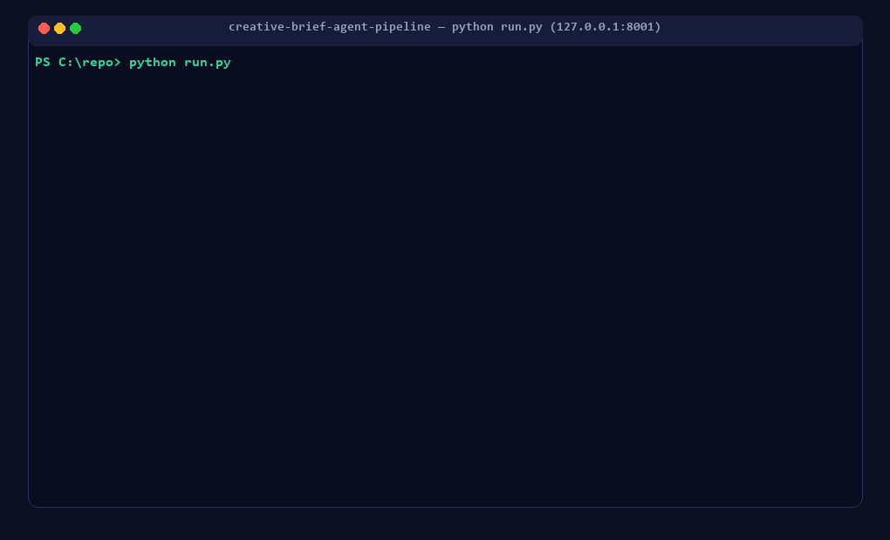

# 🎨 Creative Brief Agent Pipeline

> Turn a **messy, one-paragraph creative brief** into a **structured, validated,
> ready-to-use creative asset** — powered by a small two-agent AI workflow behind
> a single FastAPI endpoint.

[](https://www.python.org/)
[](https://fastapi.tiangolo.com/)
[](https://docs.pydantic.dev/)
[]()
[](LICENSE)

---

## 📖 About the project

Marketers don't write clean briefs. They write quick, messy sentences like:

> *"Need something for the new sneaker drop targeting gen z, kinda hype energy,
> has to be ready by friday."*

This service reads that mess and produces a **validated, structured brief** plus
**creative output** (ad concept, social caption, hashtags) — with a hard
guarantee that **bad data never silently flows downstream**.

It is built as a small **two-agent workflow**:

| Agent | Job | Plain-English |
|---|---|---|
| **Agent 1 — Parser** | Extracts structured fields from free text | Reads the messy brief and fills in a standard form |
| **Validation gate** | Checks the output against a Pydantic schema | An editor that reviews the form before it's used |
| **Agent 2 — Generator** | Produces short creative output from the **validated** brief | Writes the ad copy — only from clean data |

Between Agent 1 and Agent 2 sits a quality gate that escalates
**validate → retry (repair) → fallback (recorded defaults) → explicit error**,
so nothing invalid is ever invented or forwarded (e.g. a missing deadline is
**never** fabricated — it fails loudly with a clear 422).

### ✨ Sample input → output

| | |
|---|---|
| **Input** | `"Need something for the new sneaker drop targeting gen z, kinda hype energy, has to be ready by friday."` |
| **Parsed** | `campaign_name: Sneaker Drop Campaign` · `target_audience: Gen Z` · `tone: hype` · `deadline: 2026-09-11` *(“friday” auto-resolved)* |
| **Generated** | `ad_concept` + `social_caption` + `hashtags` (e.g. `#SneakerDropCampaign #GenZ #Hype`) |
| **Audit** | `meta.validation_attempts: 1` · `repair_passes: 0` · `fallbacks_applied: []` |

---

## 🎬 Demo

Animated walkthrough — start the server, send a brief, get validated creative:



---

## 🏗️ How it works (flow)

```
POST /api/v1/generate
  raw brief (a paragraph)
        │
        ▼
┌────────────────────┐      ┌──────────────────────────────┐
│  Agent 1 — Parser   │ ───► │        VALIDATION GATE       │
│  messy text ──►      │      │  validate ─► retry ─► fallback│
│  structured fields  │      │  ──► or surface a CLEAR error │
└────────────────────┘      └──────────────────────────────┘
                                      │ valid only
                                      ▼
                            ┌────────────────────┐
                            │  Agent 2 — Generator│
                            │  brief ──► creative  │
                            └────────────────────┘
                                      │
                                      ▼
                    200: { validated_brief, creative, meta }
              or  422: { error, issues, attempts, fallbacks }
```

**Swappable “brain”:**
- **`local` (default)** — deterministic, rule/template-based. No API key,
  zero cost, identical output every run. Perfect for demos, tests and CI.
- **`openai` (optional)** — uses a hosted LLM for richer language. Same code
  path, same validation guarantees.

> 📄 Full details: [**PRD.md**](PRD.md) · interactive docs: [**PRD.html**](PRD.html) ·
> all agent prompts & locations: [**prompts.html**](prompts.html)

---

## 🧰 Prerequisites (system requirements)

To **run** this project you need:

| Requirement | Version | Why |
|---|---|---|
| **Python** | 3.11+ (tested on 3.13) | Runtime |
| **pip** | any recent | Installing dependencies |
| **Git** *(only to clone / contribute)* | 2.x | Cloning the repo |
| *(optional)* **GitHub account** | — | Only if you want to use the **OpenAI** provider you need an API key |

> No database, no Docker, no external services required for the default
> **local** provider — it runs fully offline.

---

## 🚀 Quick start (run it)

### 1. Clone or download

```bash
# via HTTPS
git clone https://github.com/<your-username>/creative-brief-agent-pipeline.git
cd creative-brief-agent-pipeline

# …or download & extract the ZIP from the green "Code" button on GitHub.
```

### 2. Create a virtual environment (recommended)

```bash
# Windows (PowerShell)
py -m venv .venv
.venv\Scripts\Activate.ps1

# macOS / Linux
python3 -m venv .venv
source .venv/bin/activate
```

### 3. Install dependencies

```bash
# core + dev/test tools
pip install -r requirements-dev.txt

# (optional) only if you want the OpenAI provider:
# pip install -r requirements-optional.txt
```

### 4. Run the server

```bash
python run.py
# → Uvicorn running on http://127.0.0.1:8000
# (if port 8000 is blocked on your machine, use:  PORT=8001 python run.py)
```

### 5. Verify it’s up

Open <http://127.0.0.1:8000/api/v1/health> — you should see `{"status":"ok","provider":"local"}`.

---

## � Without AI vs 🤖 With AI — two run modes

The same API runs on two interchangeable "brains". **The default is *without AI* —
deterministic and fully offline** (no key, free, identical output every run).
Optionally switch to **OpenAI** for richer, model-written copy. Either way, the
validation → retry → fallback → error gate behaves identically.

| | 🚫 Local (no AI) | 🤖 OpenAI (with AI) |
|---|---|---|
| **API key** | none | required |
| **Network / cost** | offline · free | online · per-call |
| **Output** | deterministic templates | varied, natural language |
| **Extra install** | — | `requirements-optional.txt` |
| **`LLM_PROVIDER`** | `local` *(default)* | `openai` |
| **`meta.provider`** shows | `"local"` | `"openai"` |

### 🚫 Run without AI (default — nothing to configure)

```bash
pip install -r requirements-dev.txt
python run.py
# health: {"status":"ok","provider":"local"}
```

### 🤖 Run with AI (OpenAI)

```bash
# 1) extra dependency
pip install -r requirements-optional.txt

# 2) create the env file
Copy-Item .env.example .env        # Windows PowerShell
# cp .env.example .env              # macOS / Linux
```

```ini
# .env — set the provider + your key
LLM_PROVIDER=openai
OPENAI_API_KEY=sk-...
OPENAI_MODEL=gpt-4o-mini     # optional
PARSER_RETRIES=2             # optional: repair passes the gate may request
```

```bash
# 3) restart → provider: "openai"
python run.py
```

> 🔒 `.env` is git-ignored — never commit your key.

---

## �💬 How to provide a brief (give it input)

Three ways — all hit the same `POST /api/v1/generate` endpoint:

### Option A — Swagger UI (easiest, no code)
1. Open <http://127.0.0.1:8000/docs>
2. Click **`POST /api/v1/generate`** → **Try it out**
3. Paste a brief into `raw_brief` → **Execute**

### Option B — curl
```bash
curl -X POST http://127.0.0.1:8000/api/v1/generate \
  -H "Content-Type: application/json" \
  -d '{"raw_brief": "Need something for the new sneaker drop targeting gen z, kinda hype energy, has to be ready by friday."}'
```

### Option C — PowerShell
```powershell
$body = @{ raw_brief = "Need something for the new sneaker drop targeting gen z, kinda hype energy, has to be ready by friday." } | ConvertTo-Json
Invoke-RestMethod -Uri "http://127.0.0.1:8000/api/v1/generate" -Method Post -Body $body -ContentType "application/json" | ConvertTo-Json -Depth 10
```

### Sample response
```json
{
  "validated_brief": {
    "campaign_name": "Sneaker Drop Campaign",
    "target_audience": "Gen Z",
    "key_message": "The sneaker drop is live — limited pairs, no restocks. Don't sleep on it.",
    "tone": "hype",
    "deadline": "2026-09-11"
  },
  "creative": {
    "ad_concept": "The sneaker drop is live — limited pairs, no restocks. Don't sleep on it — Gen Z can't miss this one.",
    "social_caption": "…",
    "hashtags": ["#SneakerDropCampaign", "#GenZ", "#Hype", "#NewDrop", "#CopOrMiss"]
  },
  "meta": {
    "provider": "local",
    "validation_attempts": 1,
    "repair_passes": 0,
    "fallbacks_applied": []
  }
}
```

**Input format:** `raw_brief` must be 5–5000 characters of free text.
Optional `context` object is reserved for future use.

**What you can write:** anything with a product, audience, tone and/or deadline —
the parser understands ISO dates, `"september 11"`, `"next week"`, `"tomorrow"`,
plain weekdays (`"by friday"`), audience keywords (`gen z`, `millennials`, …),
tone words & synonyms (`"hype energy"`, `"high end"`, `"eco friendly"`, …).

---

## 🔑 Optional: use AI — OpenAI API key

> Full side-by-side steps are in **“Without AI vs With AI”** above; this is the key-only recap.

The default **local** brain needs no key. To use a hosted LLM instead:

1. Get an API key from <https://platform.openai.com/api-keys>.
2. Copy the env template and fill it in:
   ```bash
   cp .env.example .env        # Windows PowerShell:  Copy-Item .env.example .env
   ```
   ```ini
   # .env
   LLM_PROVIDER=openai          # "local" (default) or "openai"
   OPENAI_API_KEY=sk-...        # your secret key
   OPENAI_MODEL=gpt-4o-mini     # optional
   PARSER_RETRIES=2             # optional: repair passes the gate may request
   ```
3. Restart the server — the same API now uses the model, with **identical
   validation guarantees**.

> 🔒 **Never commit `.env`.** It is already in `.gitignore`. Add your key to a
> local `.env`, or set it as an environment variable.

---

## 🧪 Tests

```bash
python -m pytest
# → 17 passed
```

The suite covers field extraction, relative-deadline resolution
(`"friday"` → next Friday), tone-synonym mapping, fallback defaults, the
“garbage in → clear 422” path, past-deadline rejection, and the full HTTP API.

---

## 📁 Project layout

```
MTEST/
├── app/
│   ├── main.py              # FastAPI entrypoint
│   ├── api/routes.py        # POST /generate, /health, /provider
│   ├── core/                # config, logging, exceptions
│   ├── schemas/             # Pydantic contracts (brief, generation, validation)
│   ├── llm/                 # provider abstraction (local | openai)
│   ├── agents/              # Parser (Agent 1) and Generator (Agent 2)
│   └── services/            # validation gate + pipeline orchestration
├── assets/
│   └── demo.gif             # animated demo (regenerate: python scripts/make_demo_gif.py)
├── scripts/
│   └── make_demo_gif.py     # GIF generator (needs Pillow)
├── tests/                   # unit + API tests
├── run.py                   # convenience launcher
└── README.md
```

---

## 📚 Docs in this repo

| File | What it is |
|---|---|
| [`README.md`](README.md) | You are here |
| [`PRD.md`](PRD.md) | Product Requirements Document (incl. v1.1 brand & retraining design) |
| [`PRD.html`](PRD.html) | PRD as an interactive HTML doc |
| [`prompts.html`](prompts.html) | Every agent prompt with file name + location |

---

## 🛣️ Roadmap

- ✳️ Per-brand profiles + brand-compliance gate (v1.1, design in PRD §16)
- ✳️ Feedback capture & retraining loop (v1.1, design in PRD §17)
- ✳️ Simple web UI to paste a brief and click “Generate”
- ✳️ Batch import, more output formats, auth/rate limiting

## 🤝 Contributing

Issues and pull requests are welcome. Please keep the validation philosophy:
**never silently pass bad data** — add a test for any new behaviour.

---

## 📄 License

[MIT](LICENSE)
